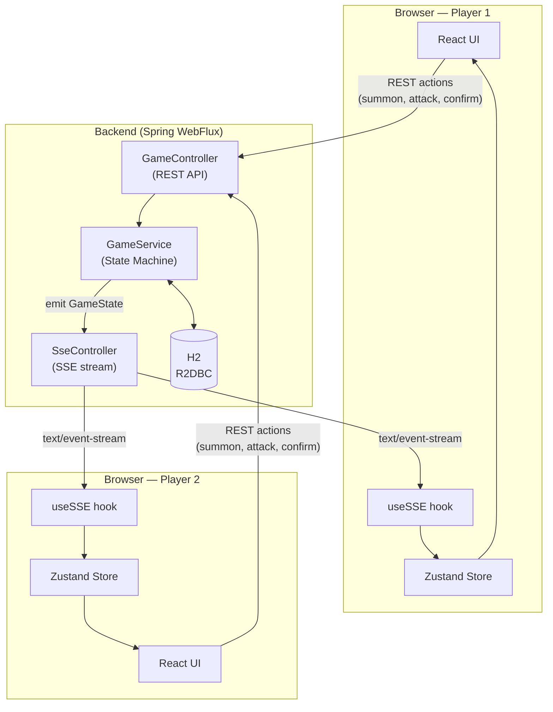

# [GAME NAME]

> A real-time multiplayer Collectible Card Game with simultaneous summoning and alternating action combat — built as a full-stack portfolio project.


---

## Description & Motivation

**[GAME NAME]** is a browser-based, two-player CCG where every turn is divided into distinct phases: a simultaneous **summoning** phase (where both players secretly place cards and reveal at the same time) and an alternating **action** phase (where units attack or use abilities one at a time).

This project was built to demonstrate:

- A **reactive Java backend** capable of managing concurrent game sessions without blocking threads
- **Real-time multi-client synchronization** using Server-Sent Events (SSE)
- A **complex finite-state machine** (turn phases, combat resolution, victory detection) implemented in a clean, testable architecture
- A **type-safe React frontend** that reacts to server-pushed events via Zustand

---

## Tech Stack & Justification

| Layer | Technology | Why |
|-------|-----------|-----|
| Backend framework | **Spring WebFlux** | Non-blocking, event-loop model — handles multiple concurrent game sessions without a thread-per-request overhead. Scales well for I/O-bound workloads like game state broadcasting. |
| Real-time comms | **SSE (Server-Sent Events)** | HTTP-native, unidirectional server→client push. Simpler than WebSocket (no upgrade handshake, works through standard proxies), and sufficient for this use case where only the server initiates updates. |
| Database access | **R2DBC** | Fully reactive, non-blocking database driver. Keeps the entire backend reactive — no JDBC blocking calls leaking into the event loop. |
| Database | **H2 (in-memory)** | Zero-config for development and demo. The R2DBC abstraction makes it trivial to swap for PostgreSQL in a production environment. |
| Frontend state | **Zustand** | Minimal boilerplate — SSE events map directly to store updates with no reducers or action creators required. |
| Language | **TypeScript** | The `GameState` type is deeply nested (players → field → units → buffs/debuffs). TypeScript prevents entire classes of runtime errors that would otherwise be hard to debug. |
| Infrastructure | **Docker Compose** | One command brings up the full stack (backend + frontend + any future services). Reproducible across environments. |

---

## Architecture Overview



**Data flow on every player action:**
1. Player sends a REST request (e.g., summon a card, confirm summoning, attack a unit)
2. `GameController` delegates to `GameService`
3. `GameService` transitions the state machine and produces a new `GameState`
4. `GameState` is persisted via R2DBC and emitted through the SSE channel
5. Both browsers receive the updated `GameState` simultaneously and re-render

---

## Game Rules Summary

### Setup
- 2 players, 40-card decks, 7 cards in opening hand
- Mana starts at 1 and increases by 1 each turn

### Turn Phases

| Phase | Description |
|-------|-------------|
| **SUMMONING** | Both players secretly choose cards to play (up to 3 on turn 1, 1 thereafter). Cards can be Units, Buffs, or Debuffs. Both must confirm before the simultaneous reveal. |
| **ACTION** | Players alternate — each activates one unit (attack or ability) per turn. Every attack triggers a mutual counter-attack. Units destroyed when incoming ATK ≥ their DEF. |
| **DRAW** | Both players draw 1 card. |
| **CHECK_VICTORY** | A player loses if their deck is empty, or if their field is empty and they cannot summon any card in hand. |

### Card Types
- **Unit** — has ATK, DEF, a class (Warrior / Mage / Paladin / Cleric / Assassin / Warlock / Archer), and 2–3 abilities (Passive or Active)
- **Buff** — applied to an allied unit during SUMMONING; raises ATK or DEF
- **Debuff** — applied to an enemy unit during SUMMONING; lowers ATK or DEF
- Each unit supports at most 1 active Buff and 1 active Debuff (no stacking)

---

## How to Run Locally

**Prerequisites:** Docker & Docker Compose installed.

```bash
git clone https://github.com/<your-username>/<repo-name>.git
cd <repo-name>
docker compose up
```

| Service | URL |
|---------|-----|
| Frontend | http://localhost:3000 |
| Backend API | http://localhost:8080 |
| H2 Console | http://localhost:8080/h2-console |

> H2 JDBC URL: `jdbc:h2:mem:f2cg` — Username: `sa` — Password: _(empty)_

---

## How to Run Tests

```bash
# Backend — unit + integration tests
cd backend
mvn test

# Frontend — component tests
cd frontend
npm test

# E2E — Playwright (full turn flow, SSE events, UI interactions)
cd frontend
npx playwright test
```

---

## Roadmap

- [ ] Deck builder UI — build and save custom decks
- [ ] Persistent player accounts — authentication and profile
- [ ] Matchmaking lobby — auto-pair players waiting for a game
- [ ] Card collection system — earn and manage cards
- [ ] Animated abilities — visual feedback for Passive and Active abilities
- [ ] Sound effects — attack, summon, victory audio
- [ ] Mobile-responsive layout
- [ ] Leaderboard — rank players by win rate

---

## Screenshots

_Coming soon — UI is under active development._

---

## License

MIT